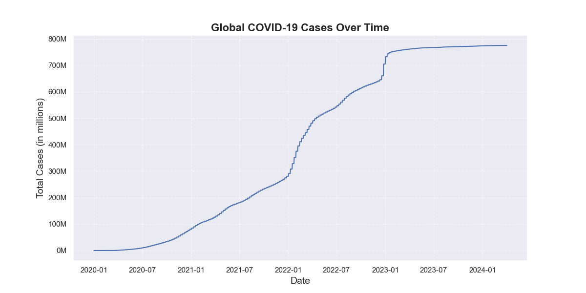
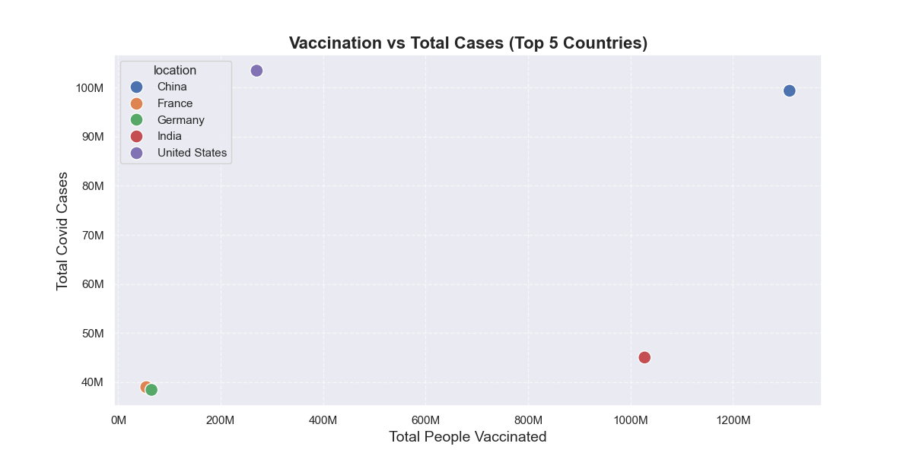
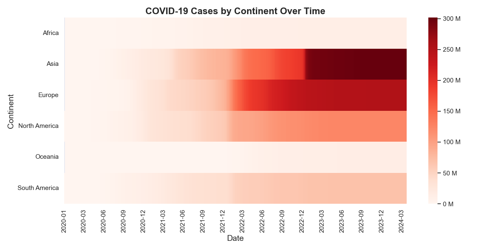
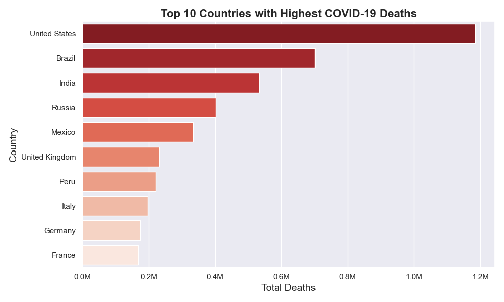

# Finding out different trends in COVID-19 dataset using Python
---
# Overview:
In this project, I have gone over the different trends that have occured in the world caused by COVID-19. I explored, cleaned the data then proceeded to visualize and analyze the different graphs. This dataset was chosen as there are many numerical values, real-life data and also because of the large amount of data.

---
# Dataset:
https://github.com/owid/covid-19-data/tree/master/public/data
> owid-covid-data.csv

This dataset contains 429435 rows and 67 columns. Some of the key columns in the dataset are countries, total_deaths, total_cases, date, population and total_vaccinations.

---
# Process:
- Loading and Exploring the dataset
- Data Cleaning(Removing duplicates, keeping only relevant columns, dealing with missing values)
- Visualization of data(Lineplot, Scatterplot, Heatmap and Barplot)

---
# Key Findings:
- There was around 760,000 total cases recorded by 2024.
- The main surge of Covid cases happened in the start of 2022.
- The US had the highest amount of recorded COVID cases.
- China had the highest amount of recorded people who had been vaccinated.
- Asia and Europe were the continents with highest amount of COVID cases recorded
- The US had more than 1.1 Million deaths because of COVID.

---

# Visualizations:

---

# Tools used:
- Python
- Numpy
- Matplotlib
- Seaborn
- Jupyter

---
# Problems/Struggles:
During the data cleaning process had to figure out and go through lots of documentations to deal with the missing values and how to fill them. Also during the visualization had to research to find out how to change the number values from scientific notation to standardized numbers.